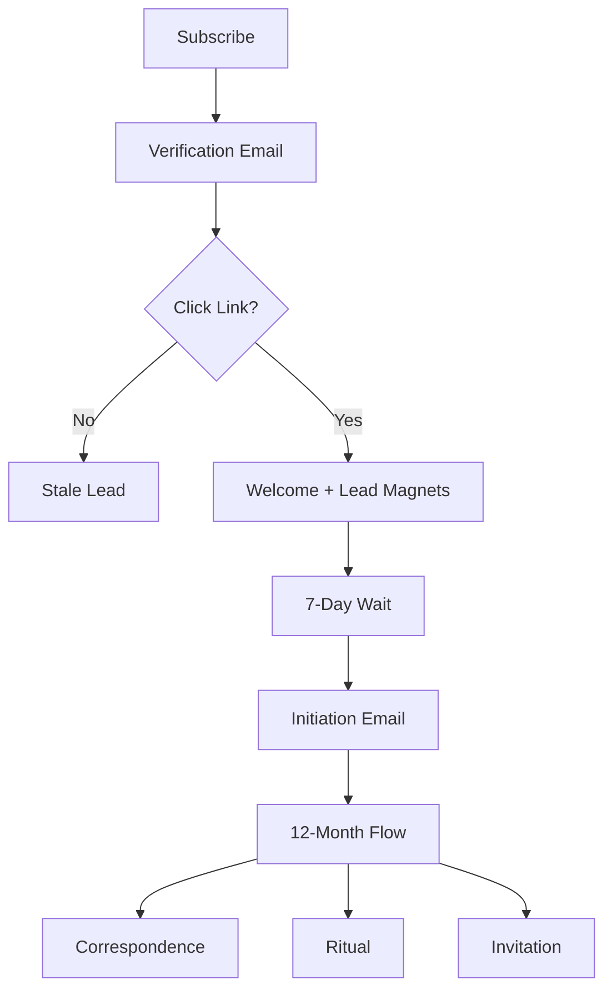

# Dreamweaving Email Sequence Audit Report

## 1. Sequence Overview
The Dreamweaving email sequence is a trust-based, multi-stage communication journey designed to move subscribers from initial discovery to a long-term, low-frequency relationship focused on "slow business" and reflection.

### High-Level Flow
1.  **Capture**: User subscribes via the `SalarsU` frontend.
2.  **Verification**: Double opt-in verification email sent immediately.
3.  **Activation**: User is marked as `marketing_subscribed` upon verification.
4.  **Onboarding**: Immediate "Welcome" email containing any requested Lead Magnets.
5.  **Steady State**: Transition to the the 12-month Dreamweaving rhythm managed by the `Dreamweaving` Python scheduler.

---

## 2. Email Inventory

| Email Type | Trigger | Timing | Content Focus |
| :--- | :--- | :--- | :--- |
| **Verification** | Newsletter Signup | Immediate | Security / Confirmation |
| **Welcome** | Email Verified | Immediate | Community access + Lead Magnets |
| **Initiation** | First Session Target | Scheduled | "Welcome quietly" / No CTA |
| **Correspondence** | Content Cluster | Every 7-14 days | Reflective letters ("Letters") |
| **Ritual** | Seasonal Calendar | Monthly/Seasonal | Marking time ("Blessings") |
| **Invitation** | Readiness Signal | Max 1/Month | Gentle offerings ("Invitations") |

---

## 3. Content Deep Dive

### Core Templates (`dreamweaving/templates/email/`)
-   **`initiation.html`**: Establishes the "quiet" brand. Informs users they won't hear from Dreamweaver often.
-   **`correspondence.html`**: 3-5 paragraphs of reflective prose. designed to be "reply-worthy" rather than "click-worthy".
-   **`ritual.html`**: Seasonal markers (Advent, Solstice, Equinox). High-trust, zero-selling emails.
-   **`invitation.html`**: Soft-sell for Dreamweavings or collections. No scarcity tactics.

### Sample Reflections (`knowledge/notion_export/pages/`)
-   *A Quiet Reflection for Those Carrying Too Much*: Focuses on invisible responsibilities and the permission to rest.
-   *A Reflection on Returning to Yourself*: Guidance on finding inner stillness amidst a crowded life.

---

## 4. Technical Architecture

The system operates across two distinct but integrated repositories:

### SalarsU (Transaction & Lifecycle)
-   **Stack**: Node.js / Next.js / Prisma / Resend.
-   **Logic**: Located in `lib/emailService.js` and `frontend/app/api/newsletter/`.
-   **Role**: Handles the high-frequency initial interactions and transactional data (Order Confirmations, Shipments).
-   **Data**: Stores subscriber status and preferences in the central PostgreSQL database.

### Dreamweaving (Brand & Trust Sequence)
-   **Stack**: Python 3 / YAML / Resend.
-   **Logic**: Managed by `scripts/ai/email_sender/email_scheduler.py`.
-   **Rhythm**: Controlled by `config/email_calendar.yaml`.
-   **Rules Engine**:
    -   **7-Day Rule**: No more than one brand email every 7 days.
    -   **Max Invitations**: Cap of 1 invitation email per month.
    -   **Seasonal Awareness**: Automatically pulls themes from the 12-month calendar.

---

## 5. Customer Journey Map

---

## 6. Key Logic & Automation

### Engagement Prioritization
The `EmailScheduler` categorizes subscribers by engagement:
-   **Replier**: Most valuable; replied to a letter.
-   **Engaged**: Open rate > 70%.
-   **Moderate**: Open rate > 30%.
-   **Passive**: Low engagement.

### The 12-Month Rhythm
Managed via `email_calendar.yaml`, defining themes like:
-   **January**: Transitions & Thresholds.
-   **April**: Slow Emergence & New Life.
-   **December**: The Quiet Midwinter.

### Spam Prevention
-   Honeypot fields.
-   Submission speed checking.
-   Rate limiting (5 attempts/hour per IP).
